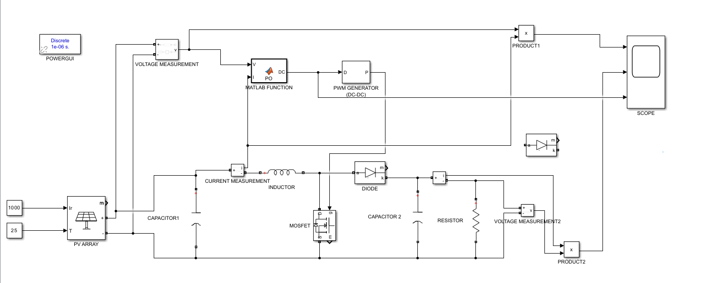
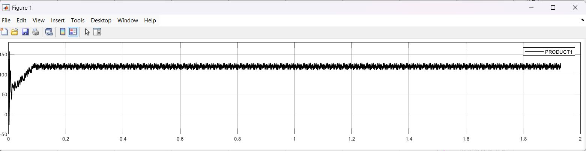
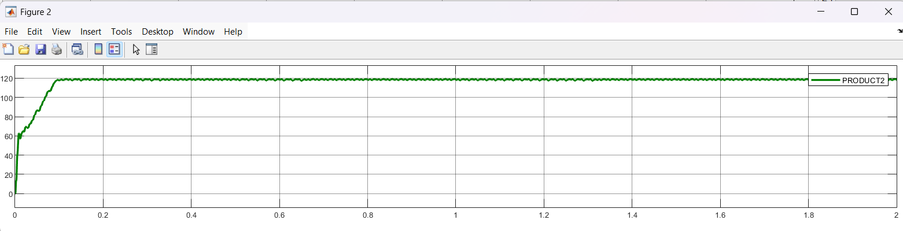
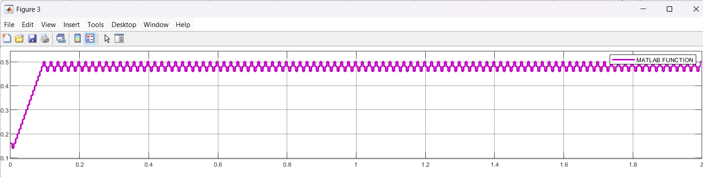

# PV Solar Power Generation with P&O MPPT

## Overview

This project presents a MATLAB/Simulink model of a photovoltaic (PV) solar power generation system with Maximum Power Point Tracking (MPPT).

A Perturb and Observe (P&O) algorithm is implemented to adjust the converter duty cycle based on the measured PV voltage and current. The system uses a MOSFET-based DC-DC boost converter with PWM control.

## System Components

- PV Array
- Voltage and Current Measurement
- Perturb and Observe (P&O) MPPT Controller
- PWM Generator
- MOSFET-based DC-DC Boost Converter
- Inductor
- Diode
- Capacitors
- Resistive Load
- Voltage, Current and Power Monitoring

## Simulation

The system is modeled and simulated in MATLAB/Simulink under different irradiance and temperature conditions.

The P&O MPPT controller continuously adjusts the converter duty cycle based on changes in PV voltage and power.
## System Model

The overall PV system is modeled in MATLAB/Simulink, including the PV array, P&O MPPT controller, PWM generator, and DC-DC boost converter.

## Simulation Results

### PV Power Response

### PV Voltage Response

### MPPT Duty Cycle

## Tools Used

- MATLAB
- Simulink
- MATLAB Function
- Power Electronics
- MPPT Control
- DC-DC Boost Converter
